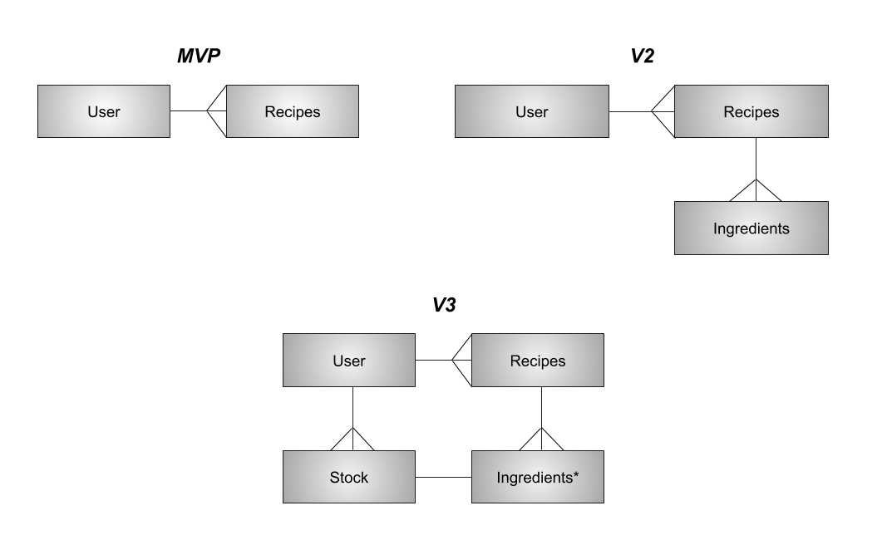

Inheritence Diagram[]

# Rails-API-Project
This is the back-end to my recipe app. It handles authentication and updating the table of recipes. Works great. No issues here (I think).

## User Stories

1.  As a user, I want to be able to sign in so that I can view recipes
1.  As a chef, I want to create recipes so that my restaurant can grow and evolve
1.  As a chef, I want to edit recipes so that my restaurant can grow and evolve
1.  As a chef, I want a completed recipe to subtract amounts from stock so I can keep track of inventory more easily.
1.  As a chef, I want to be able to log inventory so that it is kept up to date.
1.  As a chef, I want to view stock so I can get a sense of what we have and don’t have
1.  As a chef, I want to be able to delete inventory so we can account for waste
1.  As a cook, I want to view recipes so that I can save paper and make shit.
1.  As a cook, I want to be able to view stock to ensure we actually have something I need

## General Info to Remembre

### Structure
-   User can Read stock when not signed in
-   Once signed in, user can CRUD recipes
-   Once signed in, user can CRUD stock
-   Optional -- Chef is admin, CRUD recipes, CRUD Stock. Cook is one step down, can only Read recipes
-   OPTIONAL-- waste??
-   Recipes
-    Title:string, Ingredients:string, Amount:integer, Measurement:string, Instructions:string

### Viewstates
-   Landing (signed out) page -- empty
-   On sign in, recipe table (button)
-   Recipe Table
-   Recipes clickable(R), U/D on right
-   Optional Image preview??
-   20 per page?
-   On recipe click, directs to view of recipe w/ U/D/Complete
-   Ingredients/amounts
-   Instructions
-   Table w/ C/U/D
-   Updates on recipe complete
### Things to Add
- search bar
-pagination
